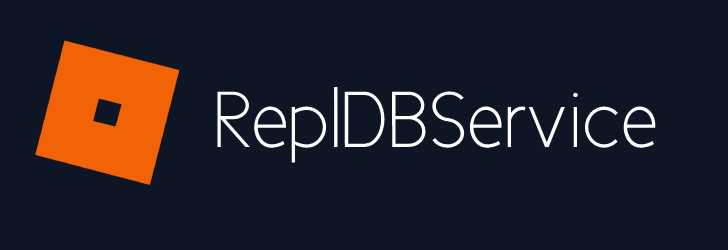

Based off of [FirebaseService](https://devforum.roblox.com/t/open-source-firebaseservice/296753)

I really just made this so you can sync your Replit projects with your ROBLOX projects, which actually seems kinda useful for moderation bots. I've already tried using an express project for a mod panel and it works!

# How to use

* Open a [replit](https://replit.com/) project.
* Go to the shell (wait for the Nix Environment to load)
* Execute the command: `echo $REPLIT_DB_URL`
* Click on the URL
* Copy the tab's url
* Put this into your script:
```lua
local RDBS = require(path.to.your.file)
local db = RDBS.new("database url, keep this very secret!")

-- Examples

db:GetKey("messageoftheday", true) -- returns "HELLO REPL"
db:GetKey("messageoftheday") -- returns HELLO REPL

db:SetKey("messageoftheday", "testing!") -- true (success?)

db:DeleteKey("messageoftheday") -- true

-- Multiple Keys
db:DeleteMultipleKeys({"key1", "key2"})
db:SetMultiple({["key1"] = "dog", ["key2"] = "cat"})
```

# Installation

## Wally

Paste this into your wally.toml dependencies:

NOTE: you dont need `[server-dependencies]` if you already have it, just put it at the bottom of the dependencies.

```toml
[server-dependencies]

repldbservice = "doqedev/repldbservice@0.2.2"

```

Learn more at [wally.run](https://wally.run)

## ModuleScript

Copy and paste [this module script](src/init.lua) into a new module script.

OR

Get this [asset](https://create.roblox.com/marketplace/asset/12789771846/ReplDBService) and put this in your game.